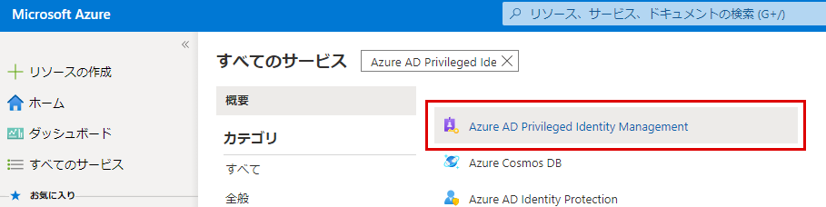

# モジュール 3 - ラボ 2 - 演習 2 - ディレクトリ ロールの割り当て

### タスク 1:ユーザーをロールの対象にする

次のタスクでは、ユーザーに Azure AD ディレクトリロールに対して適格にします。

1.  Azure Portal にサインインする

1.  Azure Portal で **[すべてのサービス]** をクリックし、`Azure AD Privileged Identity Management` を探して選択します。

     

1.  **[管理]** で **[Azure AD ロール]** を選択し、[管理] で **[ロール]** を選択します。 このオプションがまだグレー表示の場合は、ブラウザーを更新する必要があるかもしれません。

1.  [`Billing Administrator`] を選択します。

1.  **+ 割り当ての追加** を選択して メンバーの選択 を開きます。 割り当ての追加 画面で **メンバーが選択されていません** をクリックします。

1.  **[メンバーの選択] 画面** で [`Patti Fernandez`] を選び、 **[選択]** をクリックします。

1.  割り当ての追加 画面で **次へ** をクリックします。 **[割り当て]** をクリックします。  割り当てウィンドウで追加されたメンバーを確認します。

1.  ロールが割り当てられると、選択したユーザーが、ロールの **候補** としてメンバー リストに表示されます。 

### タスク 2:ロールの割り当てを永続にする

ロールの割り当てを永続化する場合は、次の手順に従ってください。

1.  Azure Portal で **[すべてのサービス]** をクリックし、`Azure AD Privileged Identity Management` を探して選択します。

     

1.  **[Azure AD roles]\(Azure AD ロール)** をクリックします。

1.  **[割り当て]** をクリックします。
 
1.  **[更新]** をクリックし、Patti を課金管理者として更新してから **[Permanently eligble]** ボックスをマークします。  メンバーシップ設定で **[保存]** をクリックします。

**結果**：Patti Fernandez の課金管理者のロールが **[永続]** としてリストされます。  つまり、Patti は恒久的に課金管理者のロールに昇格できるということです。

### タスク 3:ロールからユーザーを削除する

ロールの割り当てからユーザーを削除することはできますが、必ず、永続的な全体管理者が少なくとも 1 人は常に存在するようにしてください。

1.  Azure Portal で **[すべてのサービス]** をクリックし、`Azure AD Privileged Identity Management` を探して選択します。

     

1.  **[Azure AD roles]\(Azure AD ロール)** をクリックします。

1.  **[割り当て]** をクリックします。

1.  メンバー フィルターを使用して、再び Patti Fernandez を選択します。
 
1.  操作エリアの Eligible assignments で **削除** をクリックします。
 
1.  確認を求めるメッセージで **[はい]** をクリックします。 ロールの割り当てが削除されます。

# 演習 3 に進んでください
