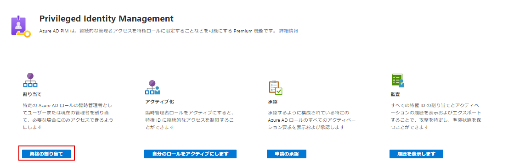
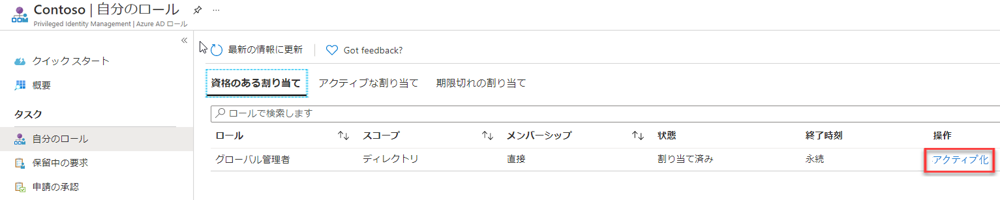
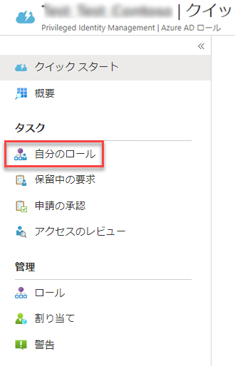
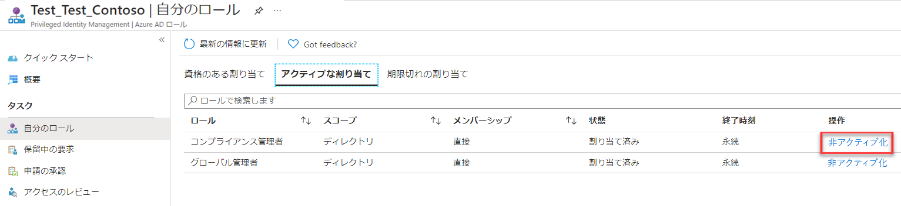
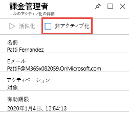

# モジュール 3 - ラボ 2 - 演習 3 - PIM ロールのアクティブ化と非アクティブ化

### タスク 1:ロールをアクティブ化する

Azure AD ディレクトリ ロールが必要な場合は、PIM の **[自分のロール]** ナビゲーション オプションを使用してアクティブ化を要求できます。

1.  Holly としてサインインした Azure Portal で、 **[すべてのサービス]** をクリックし、`Azure AD Privileged Identity Management` を探して選択します。

     

1.  **[Azure AD roles]\(Azure AD ロール)** をクリックします。
 
1.  **クイックスタート** をクリックしてから、**適格性を割り当てる** をクリックします。

     

1.  [`Billing Administrator`] をクリックして、Patti Fernandez を再び **課金管理者** ロールに追加します。

1.  **InPrivate** 閲覧セッションを開いて `https://portal.azure.com` に移動し、UPN を使用して **Patti** としてログインします。 例: ラボ ホスト側によって提供されるパスワードを使用した PattiF@YourTenantHere.onmicrosoft.com (ヒント: パスワードは、MOD 管理者パスワードと同じである可能性があります)。  

1.  Azure Portal で **[すべてのサービス]** をクリックし、 **[Azure AD Privileged Identity Management]** を検索して選択します。

     

1.  **[Azure AD roles]\(Azure AD ロール)** をクリックします。

1.  **クイックスタート** をクリックして、**ロールをアクティベートする** をクリックします。

1.  課金管理者のロールで、右にスクロールして **[アクティブにする]** をクリックします。

     

1.  **[続行する前に ID を確認してください]** と表示されたら、これをクリックします。 認証は、セッションごとに 1 回だけ行う必要があります。 ウィザードを実行して、Patti を認証します。
 
1.  Azure Portal に戻ったら、 **[すべてのサービス]** をクリックし、`Azure AD Privileged Identity Management` を探して選択します。

1.  **[Azure AD ロール]** を選択してから、クイックスタートブレードで **[Activate your role]** をクリックします。

1.  課金管理者のロールで、右にスクロールして **[アクティブにする]** をクリックします。

     

1.  アクティベーションの理由を入力して、 **[アクティブにする]** をクリックします

     

既定により、設定で明示的に構成されていない限り、ロールは承認を必要としません。 

 承認が必要ないロールは、アクティブ化され、アクティブなロールの一覧に追加されます。 すぐにロールを使用する場合は、次のセクションの手順に従ってください。

 アクティブ化に承認が必要なロールの場合は、ブラウザーの右上隅に通知が表示され、承認待ちになっていることが示されます。

### タスク 2:アクティベーション直後にロールを使用する

PIM で役割をアクティブにすると、目的の管理ポータルにアクセスしたり、特定の管理ワークロード内で機能を実行したりするまでに最大 10 分かかる場合があります。 アクセス許可の更新を強制するには、次の手順で説明されている **[アプリケーションへのアクセス]** のページを使用します。

1.  **[サインアウト]** をクリックします。

1.  inPrivate 閲覧セッションで Patti としてログインし直します。

### タスク 3:リクエストのステータスを確認する

保留中のアクティブ化要求の状態を表示することができます。

1.  **Patti** としてサインインしたまま、Azure Portal で **[すべてのサービス]** をクリックし、`Azure AD Privileged Identity Management` を探して選択します。

1.  **[Azure AD ロール]** をクリックします。

1.  **[保留中の要求]** をクリックして、要求リストを表示します。

### タスク 4:ロールを非アクティブ化する

ロールは、アクティブになった後、期限 (資格のある期間) に達すると自動的に非アクティブになります。

管理者タスクを早期に終了した場合は、Azure AD Privileged Identity Management でロールを手動で非アクティブにすることもできます。

1.  まだ **Patti** としてサインインしている状態で、Azure AD Privileged Identity Management を開きます。

1.  **[Azure AD roles]\(Azure AD ロール)** をクリックします。

1.  **[自分のロール]** をクリックします。

     

1.  **[Active assignments]** をクリックして、アクティブなロールのリストを表示します。

1.  使用が終了したロールを探し、 **[非アクティブ化]** をクリックします。

     

1.  もう一度 **[非アクティブ化]** をクリックします。

     

# 演習 4 に進んでください
